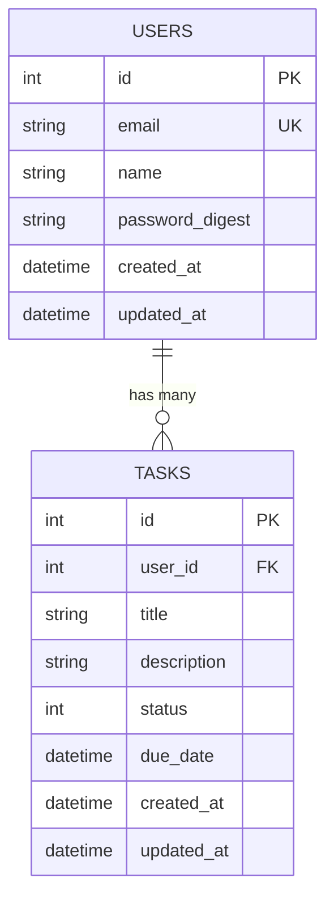

# Task Manager API

## Project Description

A RESTful API built with Ruby on Rails for managing user tasks. This application provides endpoints to create, read, update, and delete tasks with proper authentication and validation.

## Main Technologies

* Ruby version 3.2.0
* Rails version 8.0.3
* PostgreSQL version 15.2
* Docker and Docker Compose
* RSpec for testing
* RuboCop for code quality
* JSON API Serializer for API responses

## Running The Application

### Prerequisites
- Docker and Docker Compose installed on your system

### Build and Run
```bash
# Build and start the application
docker-compose up --build

# Run in detached mode
docker-compose up -d --build
```

The application will be available at:
- **URL**: http://localhost:3000
- **Port**: 3000

### Stop the Application
```bash
docker-compose down
```

## Setup the Database

### Create and Migrate Database
```bash
# Run migrations
docker-compose exec web rails db:migrate

# Create, migrate and seed the database
docker-compose exec web rails db:setup
```

### Seed the Database
```bash
# Load seed data
docker-compose exec web rails db:seed
```

This will create:
- 1 user with email: "taskmaker@email.com"
- 2 sample tasks

## Running Tests

### Run All Tests
```bash
docker-compose exec web bundle exec rspec
```

### Run Specific Test Files
```bash
# Run model tests
docker-compose exec web bundle exec rspec spec/models/

# Run request tests
docker-compose exec web bundle exec rspec spec/requests/
```

### Run RuboCop (Code Quality)
```bash
docker-compose exec web bundle exec rubocop
```

## Database ER Diagram



## API Endpoints

### Tasks

#### List all tasks
> **Endpoint**: GET http://localhost:3000/tasks  
> **Description**: List all the tasks  
> **Response**: JSON array of tasks with attributes: id, title, description, status, due_date

#### Get a specific task
> **Endpoint**: GET http://localhost:3000/tasks/:id  
> **Description**: Get a specific task by ID  
> **Response**: JSON object with task attributes

#### Create a new task
> **Endpoint**: POST http://localhost:3000/tasks  
> **Description**: Create a new task  
> **Request Body**:
```json
{
  "task": {
    "user_id": 1,
    "title": "Task Title",
    "description": "Task Description",
    "status": 0,
    "due_date": "2024-12-31T23:59:59Z"
  }
}
```
> **Response**: JSON object with created task or error messages

#### Update a task
> **Endpoint**: PATCH/PUT http://localhost:3000/tasks/:id  
> **Description**: Update an existing task  
> **Request Body**:
```json
{
  "task": {
    "title": "Updated Title",
    "description": "Updated Description",
    "status": 1,
    "due_date": "2024-12-31T23:59:59Z"
  }
}
```
> **Response**: JSON object with updated task or error messages

#### Delete a task
> **Endpoint**: DELETE http://localhost:3000/tasks/:id  
> **Description**: Delete a task  
> **Response**: 204 No Content

### Status Codes

- **200 OK**: Successful GET, POST, PUT/PATCH requests
- **204 No Content**: Successful DELETE requests
- **400 Bad Request**: Validation errors
- **404 Not Found**: Resource not found
- **500 Internal Server Error**: Server errors

### Task Status Values

- **0**: Pending
- **1**: In Progress
- **2**: Completed

## Development

### Accessing the Rails Console
```bash
docker-compose exec web rails console
```

### Viewing Logs
```bash
# View application logs
docker-compose logs web

# Follow logs in real-time
docker-compose logs -f web
```

### Database Access
```bash
# Access PostgreSQL database
docker-compose exec db psql -U postgres -d task_manager_development
```

## Project Structure

```
task-manager/
├── app/
│   ├── controllers/
│   │   └── tasks_controller.rb
│   ├── models/
│   │   ├── user.rb
│   │   └── task.rb
│   └── serializers/
│       └── task_serializer.rb
├── config/
│   ├── database.yml
│   └── routes.rb
├── db/
│   ├── migrate/
│   └── seeds.rb
├── spec/
│   ├── models/
│   └── requests/
├── docker-compose.yml
├── Dockerfile
└── README.md
```